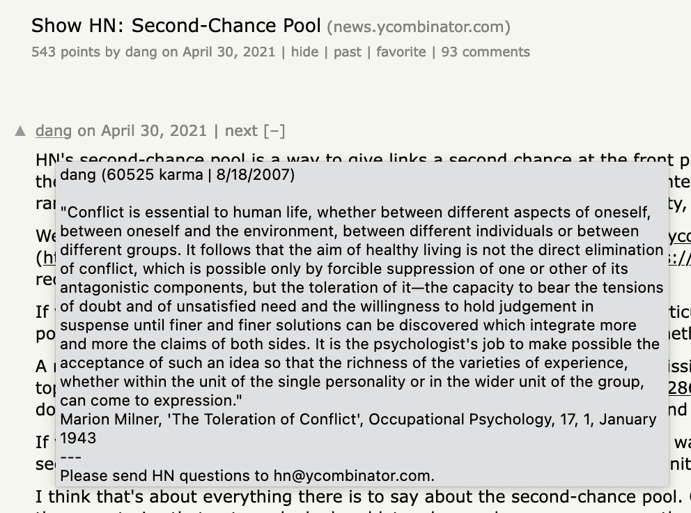

# HN Pop-Up: Profile Overlay for HN

Hacker News User Link Pop-up lets you quickly glance at a user's profile without
leaving the page you're on.

You can quickly see a user's about, karma and sign up date.

## Installation

### Chrome
`https://chrome.google.com/webstore/detail/hacker-news-user-link-pop/clfaigfmebhcgofincgbmofoiomlhbfo`

### Firefox
`https://addons.mozilla.org/en-US/firefox/addon/hn-pop-up/`

## Debugging / Local Installation

### Firefox

For some reason, Firefox does not whitelist the domain `https://hacker-news.firebaseio.com/` under the `host_permissions` key in the manifest, when we use manifest v3. For that reason, we use the manifest v2 for FireFox. The Firefox configuration is in `manifes_ff.json`

- Clone or download this repository
- Copy everything from `manifest_ff.json` into `manifest.json`
- Go to `about:debugging` (type in the address bar)
- Click *This Firefox* > *Load Temporary Add-On*
- Browse to the extension folder and select `manifest.json`
- Click *Reload* after making any code changes

### Chrome

- Clone or download this repository
- Go to `chrome://extensions` (type in the address bar)
- Click "Load Unpacked" and select the extension folder

## Functionality

This extension enumerates all user links on a page and attaches a one-shot
`mouseover` event handler to each one.

When the link is hovered over for the first time, it hits the Hacker News API to
obtain the profile information:
`https://hacker-news.firebaseio.com/v0/user/${id}.json`

Once downloaded, the profile information is formatted into a multi-line string
and used as a `title` of the link `a` element.
Subsequent hovering over the link won't make another network request, instead
the existing `title` attribute value is presented by the browser.

The extension is supported by Chrome and Firefox.
Safari support is untested.

## Security & Privacy

This extension only has access to `https://news.ycombinator.com/*` and
`https://hacker-news.firebaseio.com/*` and only accesses the page DOM.

It does not access your Hacker News cookies or other personal data in any way.

## Community

Feel free to open issues or submit PRs.

## To-Do

### Test the extension in Safari and submit to Apple's extension store

Safari should support Web Extensions so without any code changes, the same code
should work in Safari, too.
I have access to macOS Safari so I will test the extension and publish it for
the Apple Safari extension store if it indeed works and doesn't cost too much.
(I am not sure if the Safari extension store is subject to the Developer fee.)

### Come up with a new icon

I am thinking a nicer icon could be possible to make.
Something with the HN letters with a masked out silhouette or similar.
